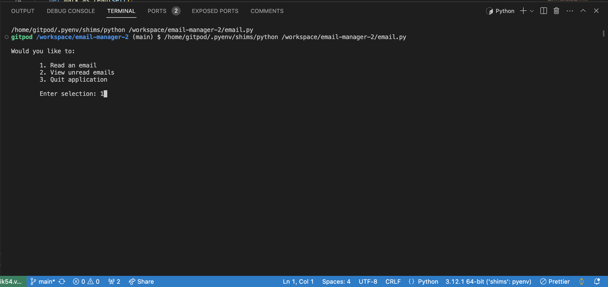
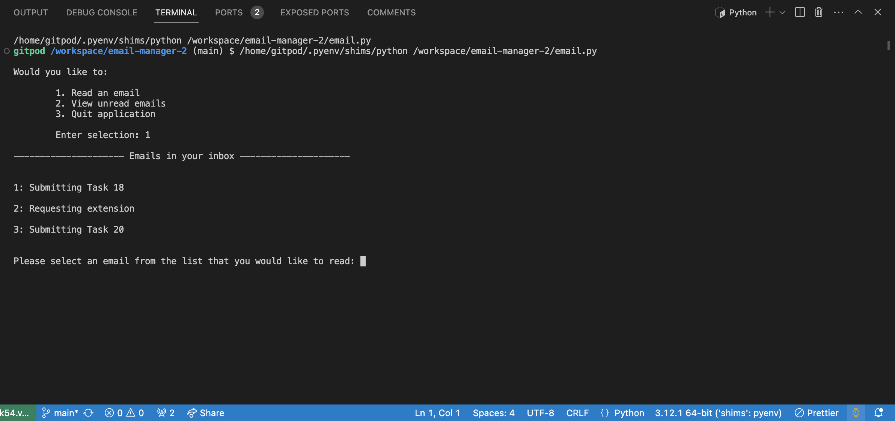
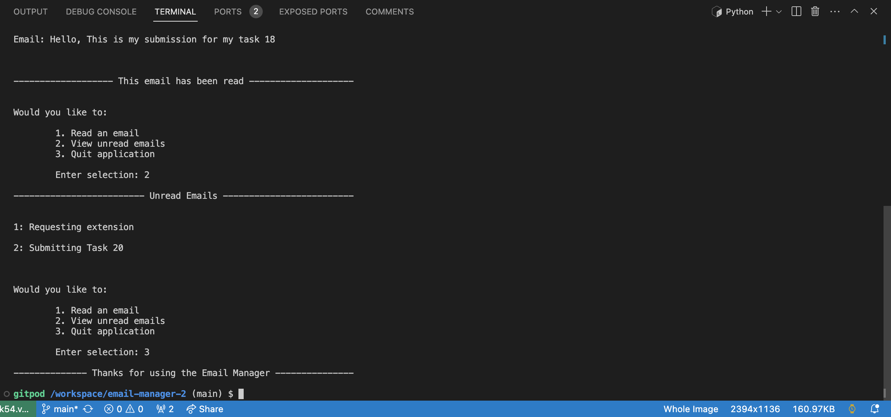

# Email Manager

## Description
### A program which involves an email simulator, replicating what it's like to view an email inbox and read emails individually, developed on VScode using Python.

## Languages used
* Python

# Goals
* To provide a simple to navigate program, ensuring that information is clear and consise.
* To provide the user the option to view who the email recipient is from along with the subject line before reading the email.
* To provide the user with the ability to keep track of which emails have been read and unread whilst running the program.
* To provide a seemless user experience incorporating error handling so that the program continues if any arise.

# Installation
It is recommended to download a code editor such as VScode if you don't have one, although you can view this project in a browser.
* Go to https://github.com/cfff226/email-manager-2
* Select the repository.
* Navigate to the green button labeled 'Code'.
* Select 'Download ZIP'.
* Open up your code editor.
* Select 'File' and navigate to 'Open Folder' from the tab at the top of your screen.
* Select the downloaded folder from the pop up window.
* Open the downloaded folder, this will open all files from the zip folder in the code editor.

# Usage
* Select the triangular play button in the top right corner of the code editor to start the program

* Enter '1' to read an email

* Enter the number of the email that you would like to read

* Enter '2' to view your unread emails

* Enter '3' to exit the program

